# My Application - Android 音乐播放器

## 项目愿景

一款基于 Kotlin + Jetpack Compose 构建的 Android 音乐播放器应用，聚合网易云音乐、QQ 音乐、酷我音乐三大平台，提供搜索、排行榜、歌单、收藏、最近播放、每日推荐、歌词展示等完整音乐体验。采用 Glassmorphism (毛玻璃) UI 风格，支持明暗主题。

## 架构总览

- **语言**: Kotlin 100%
- **UI 框架**: Jetpack Compose + Material 3
- **架构模式**: 单 Activity、MVVM + Clean Architecture（domain/data/feature 分层）
- **依赖注入**: Hilt (Dagger)
- **网络**: Retrofit + OkHttp + Kotlinx Serialization
- **本地存储**: Room (SQLite) + DataStore (Preferences)
- **媒体播放**: Media3 (ExoPlayer) + MediaSession
- **图片加载**: Coil
- **导航**: Navigation Compose (Type-safe routes)
- **构建**: Gradle 8.11.1, AGP, compileSdk 36, minSdk 26, targetSdk 36
- **后端 API**: TuneHub V3 (tunehub.sayqz.com) -- 提供解析与方法下发

### 核心架构特色: 方法下发 (Dispatch) 引擎

应用不直接硬编码各音乐平台的 API 调用方式，而是通过 TuneHub 后端的"方法下发"机制运行：
1. 客户端从 `/v1/methods/{platform}/{function}` 获取请求配置模板（URL、参数、headers、transform 规则）
2. `TemplateRenderer` 将模板变量（keyword、page 等）替换为实际值
3. `DispatchExecutor` 使用 OkHttp 直接请求上游平台
4. `TransformEngine` 根据 transform 规则或智能回退（alias + scoring）将响应解析为 `Track` 列表

此设计使得搜索/榜单/歌单等非核心功能不消耗 API 积分，仅解析播放地址（`/v1/parse`）和歌词时消耗积分。

## 模块结构图

```mermaid
graph TD
    A["(根) music"] --> B["app"]
    B --> C["app / MusicApplication"]
    B --> D["core"]
    B --> E["data"]
    B --> F["domain"]
    B --> G["feature"]
    B --> H["media"]
    B --> I["di"]
    B --> J["ui/theme"]

    D --> D1["common"]
    D --> D2["database"]
    D --> D3["datastore"]
    D --> D4["network"]

    E --> E1["remote/dto"]
    E --> E2["repository"]

    F --> F1["model"]
    F --> F2["repository (interfaces)"]

    G --> G1["home"]
    G --> G2["search"]
    G --> G3["library"]
    G --> G4["discover"]
    G --> G5["more"]
    G --> G6["player"]
    G --> G7["playlist"]
    G --> G8["components"]

    H --> H1["player"]
    H --> H2["service"]
    H --> H3["session"]
    H --> H4["state"]

    click D "./app/src/main/java/com/music/myapplication/core/CLAUDE.md" "查看 core 模块文档"
    click E "./app/src/main/java/com/music/myapplication/data/CLAUDE.md" "查看 data 模块文档"
    click F "./app/src/main/java/com/music/myapplication/domain/CLAUDE.md" "查看 domain 模块文档"
    click G "./app/src/main/java/com/music/myapplication/feature/CLAUDE.md" "查看 feature 模块文档"
    click H "./app/src/main/java/com/music/myapplication/media/CLAUDE.md" "查看 media 模块文档"
```



## 模块索引

| 模块路径 | 职责 | 关键文件数 | 测试覆盖 |
|---------|------|-----------|---------|
| `app/` (入口) | Application, MainActivity, AppRoot, Navigation | 5 | 无 |
| `core/common` | Result 封装, AppError 类型, DispatchersProvider | 4 | 无 |
| `core/database` | Room 数据库, DAO, Entity, Mapper | 12 | 无 |
| `core/datastore` | DataStore 偏好设置, 首页内容缓存 | 2 | 无 |
| `core/network` | Retrofit API, Dispatch 引擎 (TemplateRenderer, TransformEngine, DispatchExecutor), 拦截器 | 9 | 2 (TemplateRendererTest, TransformEngineTest) |
| `data/remote/dto` | 网络 DTO 数据类 | 2 | 无 |
| `data/repository` | Repository 实现 (Online, Local, Recommendation) | 3 | 2 (OnlineMusicRepositoryImplTest, RecommendationRepositoryImplTest) |
| `domain/model` | 领域模型 (Track, Playlist, Platform, PlaybackState 等) | 6 | 无 |
| `domain/repository` | Repository 接口定义 | 3 | 无 |
| `feature/home` | 首页: 排行榜 + 每日推荐 | 2 | 无 |
| `feature/search` | 搜索: 跨平台搜索 + 分页 | 2 | 1 (SearchViewModelTest) |
| `feature/library` | 我的: 收藏/最近播放/歌单管理 | 2 | 无 |
| `feature/player` | 播放器: 全屏/迷你/歌词/旋转封面/控制 | 10 | 无 |
| `feature/playlist` | 歌单详情页 | 2 | 1 (PlaylistDetailViewModelTest) |
| `feature/discover` | 发现页 | 1 | 无 |
| `feature/more` | 更多设置 (API Key 管理) | 2 | 无 |
| `feature/components` | 共享 UI 组件 | 8 | 无 |
| `media/` | 媒体播放引擎 (ExoPlayer, Service, Session, State) | 4 | 无 |
| `di/` | Hilt DI 模块 | 4 | 无 |
| `ui/theme` | 主题/颜色/字体/毛玻璃效果 | 5 | 无 |

## 运行与开发

### 环境要求
- Android Studio (推荐 Ladybug+)
- JDK 11+
- Android SDK: compileSdk 36, minSdk 26

### 构建与运行
```bash
# 调试构建
./gradlew assembleDebug

# 安装到设备
./gradlew installDebug

# 运行单元测试
./gradlew testDebugUnitTest
```

### API Key 配置
在 `gradle.properties` 或 `local.properties` 中添加:
```properties
TUNEHUB_API_KEY=th_your_api_key_here
```
也可在应用内"更多"页面动态设置 API Key。

### 关键依赖
- `androidx.compose.bom` -- Compose 版本统一管理
- `hilt-android` + `hilt-navigation-compose` -- DI
- `retrofit` + `kotlinx-serialization-json` -- 网络
- `room-runtime` + `room-ktx` -- 本地数据库
- `media3-exoplayer` + `media3-session` -- 播放
- `coil-compose` -- 图片
- `navigation-compose` -- 导航
- `datastore-preferences` -- 偏好存储
- `palette-ktx` -- 动态主题色提取
- `androidx.metrics.performance` -- JankStats 性能监控

## 测试策略

### 现有测试 (7 个测试文件)
| 测试文件 | 测试目标 | 框架 |
|---------|---------|------|
| `ExampleUnitTest.kt` | 模板测试 | JUnit |
| `ExampleInstrumentedTest.kt` | 模板 UI 测试 | AndroidX Test |
| `TemplateRendererTest.kt` | 模板变量渲染 | JUnit + MockK |
| `TransformEngineTest.kt` | JSON 转 Track 转换 | JUnit + MockK |
| `SearchViewModelTest.kt` | 搜索逻辑 | JUnit + MockK + Coroutines Test |
| `PlaylistDetailViewModelTest.kt` | 歌单详情逻辑 | JUnit + MockK + Coroutines Test |
| `OnlineMusicRepositoryImplTest.kt` | 在线音乐仓库 | JUnit + MockK |
| `RecommendationRepositoryImplTest.kt` | 推荐算法 | JUnit + MockK |

### 测试框架
- JUnit 4
- MockK (Kotlin mock 框架)
- kotlinx-coroutines-test
- Espresso (instrumented)

### 测试覆盖缺口
- `PlayerViewModel` -- 核心播放逻辑未测试
- `HomeViewModel` -- 首页逻辑未测试
- `LibraryViewModel` -- 我的页面逻辑未测试
- `LocalLibraryRepositoryImpl` -- 本地存储逻辑未测试
- `DispatchExecutor` -- Dispatch 引擎未测试
- `MusicPlaybackService` -- 播放服务未测试
- 所有 DAO 均未做 instrumented 测试

## 编码规范

- **语言**: Kotlin, 遵循 `kotlin.code.style=official`
- **JVM Target**: 11
- **包结构**: `com.music.myapplication.{layer}.{feature}`
- **架构约束**:
  - `domain` 层不依赖任何框架（纯 Kotlin）
  - `data` 层实现 `domain` 接口
  - `feature` 层通过 Hilt 注入 ViewModel，ViewModel 仅依赖 `domain` 接口
- **Compose**: 使用 `collectAsStateWithLifecycle` 收集 Flow
- **协程**: IO 操作使用 `dispatchers.io`，通过 `DispatchersProvider` 注入（方便测试）
- **错误处理**: 使用 `sealed interface Result<T>` 统一包装，`AppError` 分类错误
- **中文 UI**: 所有用户可见文本为中文

## AI 使用指引

### 修改代码前务必了解

1. **方法下发体系**: 搜索/榜单/歌单功能依赖服务端下发模板，不要硬编码平台 API
2. **Track 是核心模型**: 几乎所有数据流最终产出 `Track` 列表，修改 Track 字段需评估全链路影响
3. **PlayerViewModel 是全局共享的**: 通过 `hiltViewModel()` 在 `AppRoot` 创建，多页面共享同一实例
4. **Platform 枚举**: 新增平台需同时更新 `Platform.kt`、UI 过滤组件、Repository 实现
5. **封面补全机制**: 各平台封面 URL 获取方式不同，在 `OnlineMusicRepositoryImpl` 中有平台特定的 enrich 逻辑
6. **QQ 音乐 ID 兼容**: QQ 音乐存在数字 ID 与 songMid 两种 ID 体系，`PlayerViewModel.resolveTrackForPlayback` 有兜底重试逻辑

### 常用入口
- **导航定义**: `app/navigation/Routes.kt` + `AppNavGraph.kt`
- **DI 配置**: `di/` 目录下 4 个 Module
- **API 接口**: `core/network/retrofit/TuneHubApi.kt`
- **数据库 Schema**: `core/database/AppDatabase.kt` + `entity/` 目录
- **主题**: `ui/theme/` 目录

## 变更记录 (Changelog)

| 日期 | 操作 | 说明 |
|------|------|------|
| 2026-03-08 | 初始化 | 初次扫描生成项目文档，覆盖率 100% |
